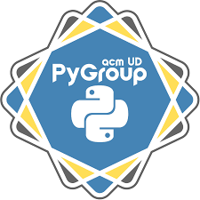

  

<h1 align="center">Bot de Correo Spam</h1>

<b>Sebastian David Trujillo Vargas 
  Yhoan Mauricio Bermudez Tique 
  21/10/2025 
  Python de 0 a 100 </b> 

<h2>Descripción</h2>

El proyecto consiste en un bot automatizado desarrollado en Python que ayuda a los estudiantes a limpiar su bandeja de entrada eliminando mensajes 
no deseados o spam. 
El bot utiliza reglas simples y conexión IMAP para analizar los correos y mover los mensajes sospechosos a la carpeta de spam o eliminarlos. De esta manera, el usuario ahorra tiempo y mantiene su correo organizado. 

<h3>Problemática o necesidad</h3>

Los estudiantes suelen recibir gran cantidad de correos no deseados: promociones, suscripciones y notificaciones irrelevantes. Revisar y borrar estos mensajes manualmente consume tiempo que podría aprovecharse en tareas académicas. Este bot busca automatizar esa limpieza, detectando mensajes de spam con base en palabras clave o remitentes repetidos. 

<h2>Descripción General</h2>

Este proyecto es un <strong>bot automatizado en Python</strong> que analiza los correos electrónicos de la cuenta del usuario, identifica mensajes no deseados mediante palabras clave y los elimina o marca como spam.

<h3>¿Qué hace el proyecto?</h3>
<ol>
  <li>Analiza los correos electrónicos de la cuenta del usuario.</li>
  <li>Identifica mensajes que contienen palabras clave como “promoción”, “suscríbete”, “casino”, “gana dinero”, etc.</li>
  <li>Los marca como spam o los elimina directamente.</li>
</ol>

<h3>⚙️ ¿Cómo funciona?</h3>
<ol>
  <li>El usuario ejecuta el bot desde la consola.</li>
  <li>Se conecta a su cuenta de correo mediante el protocolo <strong>IMAP</strong> (autenticación segura con usuario y contraseña de aplicación).</li>
  <li>Descarga los asuntos y remitentes de los correos recientes.</li>
  <li>Aplica reglas de detección (por palabras clave o listas de remitentes).</li>
  <li>Mueve o elimina los mensajes clasificados como spam.</li>
</ol>

<h3>Resultados esperados</h3>
<ul>
  <li>Bandeja de entrada más limpia y ordenada.</li>
  <li>Ahorro de tiempo al eliminar correos basura automáticamente.</li>
  <li>Reporte con cantidad de correos revisados, detectados y eliminados.</li>
</ul>

<h2>Alcance</h2>

<h3>Qué si incluirá</h3>
<ul>
  <li>Conexión IMAP al correo electrónico.</li>
  <li>Búsqueda y lectura de correos recientes.</li>
  <li>Filtrado mediante palabras clave y remitentes.</li>
  <li>Eliminación o traslado a carpeta de spam.</li>
  <li>Generación de un reporte con estadísticas.</li>
  <li>Interfaz por consola simple para que el usuario elija acciones.</li>
</ul>

<h3>Qué no incluirá</h3>
<ul>
  <li>No implementará un modelo de inteligencia artificial.</li>
  <li>No manejará interfaz gráfica</li>
</ul>

<em>Estas funciones quedan fuera del alcance por la complejidad técnica y el tiempo disponible.</em>

<h2>0Categoría</h2>

La aplicación cae en las categorías de <strong>automatización</strong> y <strong>aplicación interactiva por consola</strong>.

<h2>Tecnologías y Herramientas</h2>
<ul>
  <li><strong>Lenguaje:</strong> Python 3.11</li>
  <li><strong>Entorno:</strong> Visual Studio Code</li>
  <li><strong>Protocolo:</strong> IMAP (para leer correos)</li>
</ul>

<h3>Librerías principales</h3>
<table>
  <tr><th>Librería</th><th>Función</th></tr>
  <tr><td>imaplib</td><td>Conexión y lectura de correos.</td></tr>
  <tr><td>email</td><td>Análisis del contenido de los mensajes.</td></tr>
  <tr><td>re</td><td>Búsqueda de palabras clave con expresiones regulares.</td></tr>
  <tr><td>pandas</td><td>Manipulación de datos y generación de reportes.</td></tr>
</table>

<h2>Fuentes de Datos</h2>
<ol>
  <li>Ingresadas por el usuario: correos o contraseñas.</li>
  <li>Respuestas de la API de Microsoft y conexión IMAP.</li>
</ol>

🔗 <a href="https://learn.microsoft.com/es-es/graph/use-the-api">Documentación de Microsoft Graph API</a>

<h2>Conceptos aplicados del curso</h2>
<table>
  <tr><th>Concepto</th><th>Aplicación</th></tr>
  <tr><td>Variables y tipos de datos</td><td>Almacenar los correos y contraseñas.</td></tr>
  <tr><td>Estructuras de control</td><td>Validar conexión a cada correo ingresado.</td></tr>
  <tr><td>Funciones</td><td>Funciones de conexión, lectura, modificación y borrado.</td></tr>
  <tr><td>Funciones Lambda</td><td>Transformaciones de datos con <code>map()</code> y <code>filter()</code>.</td></tr>
  <tr><td>*args y **kwargs</td><td>?.</td></tr>
  <tr><td>Pandas</td><td>Manipulación de DataFrames y generación de reportes.</td></tr>
  <tr><td>Manejo de archivos</td><td>Lectura/escritura de CSV</td></tr>
  <tr><td>Manejo de errores</td><td>Uso de <code>try/except</code> para fallas de conexión a cuenta, conexión de internet o respuesta de API de correo.</td></tr>
</table>

<h2>Resultados Esperados</h2>
<ul>
  <li>Bot funcional que detecta y elimina correos spam.</li>
  <li>Reporte automático con estadísticas: revisados, eliminados y tiempo de ejecución.</li>
  <li>Código modular, limpio y documentado.</li>
</ul>

